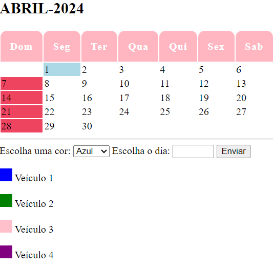

# calend-rio

**📅 Calendário Interativo**
Bem-vindo ao Calendário Interativo! Este é um projeto incrível que vai revolucionar a maneira como você organiza seu tempo. Combinando funcionalidade avançada e design elegante, este calendário é a ferramenta perfeita para transformar suas tarefas diárias em uma experiência visualmente cativante.

💡 Por que usar o Calendário Interativo?
Organização Visual: Marque seus eventos, compromissos e prazos com cores vibrantes para uma visão instantânea de sua agenda.

**🚀 Como Usar**
Abra o Arquivo: Basta abrir o arquivo index.html em seu navegador favorito para acessar o calendário interativo.

Escolha uma Cor: Selecione uma cor na lista suspensa para representar o evento ou compromisso.

Insira o Número do Dia: Digite o número do dia que deseja marcar com a cor selecionada.

Clique em "Colorir": Assista ao seu calendário ganhar vida enquanto o dia selecionado é preenchido com a cor escolhida!

**🌟 Funcionalidades:**
Marcação de Dias com Cores: Os colaboradores podem selecionar um dia no calendário e atribuir a ele a cor correspondente ao veículo que realizará o frete.

Identificação de Veículos: Cada veículo é representado por uma cor específica, facilitando a identificação no calendário:

Azul para o veículo 1
Verde para o veículo 2
Rosa para o veículo 3
Roxo para o veículo 4
Legenda de Cores: Uma legenda na aplicação permite aos usuários identificar facilmente a cor de cada veículo.

**🌈 Desenvolvimento:**
Este projeto foi desenvolvido utilizando as seguintes tecnologias:

HTML5: Para estruturação do conteúdo e criação dos elementos do calendário.
CSS3: Para estilização do calendário e criação de uma interface intuitiva.
JavaScript: Para implementação da lógica de interação do usuário e marcação dos dias com as cores dos veículos.

**🌟Como Utilizar:**
Selecione um dia no calendário.
Escolha a cor correspondente ao veículo que realizará o frete.
Clique no botão "Agendar" para confirmar a marcação.

**🌟 Exemplo**
Quer ver o Calendário Interativo em ação? Confira uma demonstração ao vivo aqui!

**📄 Esse projeto foi procuzido por**
luamy alves gama 

**📂 Link do Repositório:**

